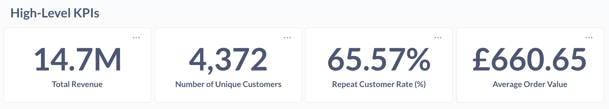

# SQL – 2-Week Project

## Overview

This repository showcases my work from a 2-week intensive SQL project, demonstrating **professional SQL skills** applied to real-world datasets.
The focus is on writing advanced queries, analyzing data, designing databases, building pipelines, and delivering actionable business insights. 

## Skills Demonstrated
- Writing **complex SQL queries** with joins, subqueries, aggregations, and window functions
- Performing **data modeling**: normalization, ER diagrams, and star schemas
- Optimizing queries for **performance on large datasets**
- Building **ETL pipelines** and transforming raw data into analytics-ready tables
- Implementing **security best practices**, restricted views, and role-based access
- Creating **dashboards** to visualize business KPIs
- Using professional workflows with **GitHub version control** and SQL documentation
- Translating **business questions into actionable metrics**

All work is done using **Supabase** (PostgreSQL) for the database, **pgAdmin** for query testing, and **VSCode + GitHub** for version control and documentation.  

---

## Datasets

**1. Kaggle Online Retail Dataset (~0.4M rows)**  
- Source: [Kaggle E-commerce Dataset](https://www.kaggle.com/datasets/carrie1/ecommerce-data)  
- Description: Contains transactions from an online retail store, including invoice numbers, product codes, descriptions, quantities, prices, and customer info.  
- Imported into Supabase as table: `kaggle_ecommerce_dataset`  
- A synthetic primary key (`id`) has been added for unique row identification.
  
**2. NYC Taxi Trip Data, 1 month (trimmed) (~1M rows)**
- Source: [NYC Taxi Trip Dataset, January 2025 Yellow Taxi Trip Records] https://www.nyc.gov/site/tlc/about/tlc-trip-record-data.page
- Description: Trimmed Yellow Taxi dataset (trimmed due to database size restrictions) (~1M rows) containing only key columns for query optimization: vendor ID, pickup/dropoff timestamps, passenger count, trip distance, payment type, and fare-related amounts.
- Kept only numeric and categorical fields relevant for aggregation, filtering, and indexing practice and dropped irrelevant columns (e.g., extra fees, airport fees, congestion surcharges).
- Imported into Supabase as table: `nyc_yellow_taxi_jan2025`
- A synthetic primary key (`id`) has been added for unique row identification.

**3. Optional Additional Datasets:**  
- Airbnb Seattle Data: [Kaggle Airbnb Dataset](https://www.kaggle.com/datasets/airbnb/seattle)  
- BigQuery public datasets for cloud practice  

---

## 2-Week SQL Project Overview

### Week 1 – Core SQL + Foundations

- [Kaggle Ecommerce Dataset] **Day 1: Advanced SQL Queries** 
  Focus on joins, subqueries, and window functions using the Kaggle dataset.  
  <details> 
  <summary>Tasks / Approach </summary>
    
    - **Top 5 Loyal Customers Per Year:** aggregation, window functions, time-based analysis<br>
      - **File:** [`Top5_Loyal_Customers_Per_Year.sql`](sql/1_Advanced_SQL_Queries/Top5_Loyal_Customers_Per_Year.sql)
    - **Top 5 Customers Per Month:** aggregation, window functions, date truncation<br>
      - **File:** [`Top5_Customers_Per_Month.sql`](sql/1_Advanced_SQL_Queries/Top5_Customers_Per_Month.sql)
    - **Lowest Revenue Product Per Country:** aggregation, window functions, string aggregation
      - **File:** [`Lowest_Revenue_Product_Per_Country.sql`](sql/1_Advanced_SQL_Queries/Lowest_Revenue_Product_Per_Country.sql)
    - **Customer Purchase A&B:** joins, aggregation, window functions, subqueries
      - **File:** [`Customer_Purchases_A&B.sql`](sql/1_Advanced_SQL_Queries/Customers_Purchase_A&B.sql)
    
  </details>

- [NYC Taxi Trip Dataset] **Day 2: Query Optimization & Large Data**
  Query optimisation & indexing on large datasets

  <details>
    <summary>Step 1: Identify a slow query</summary>

    **Count all trips over or equal to 5 miles with fare ≥ 20 and with a passenger count equal to 4**

    **Query**
    ```sql
    SELECT COUNT(id)
    FROM nyc_yellow_taxi_jan2025
    WHERE trip_distance >= 5 AND fare_amount >= 20 AND passenger_count = 4;
    ```

    **Observation**
    - This query takes a time of (~1.41 seconds) because it performs a **sequential scan** over all 1M rows.
    - Most rows are filtered out, so the scan is inefficient.<br>
    - (Note: I previously filtered on only trip_distance and fare_amount which caused the index to be slower showing that an index is not always beneficial. This illustrates that indexes are only beneficial when the filter is selective enough to significantly reduce rows scanned.)

    <br>

    **EXPLAIN ANALYZE Output (baseline without index):**
    <details>
      <summary>Click to expand</summary>

      ```
      Gather  (cost=24670.13..24670.24 rows=1 width=8) (actual time=1406.119..1412.717 rows=2 loops=1)
        Workers Planned: 1
        Workers Launched: 1
        Partial Aggregate  (cost=23670.13..23670.14 rows=1 width=8) (actual time=1354.359..1354.359 rows=1 loops=2)
        Parallel Seq Scan on nyc_yellow_taxi_jan2025  (cost=0.00..23670.12 rows=5 width=4) (actual time=362.282..1354.205 rows=233 loops=2)
          Filter: ((trip_distance >= '20'::double precision) AND (fare_amount >= '50'::double precision) AND (passenger_count = 4))
          Rows Removed by Filter: 499767
      Planning Time: 0.141 ms
      Execution Time: 1412.763 ms
      ```

    </details>
  </details>

  <details>
    <summary>Step 2: Create a composite index to optimise above query</summary>

    **Index on trip_distance, fare_amount, and passenger_count**

    **Query**
    ```sql
    CREATE INDEX index_distance__passenger_fare
    ON nyc_yellow_taxi_jan2025(trip_distance, fare_amount, passenger_count);
    ```

    **Observation**
    - This query takes a time of (~0.03 seconds) because it performs a **index scan** over the specified rows.

    <br>

    **EXPLAIN ANALYZE Output (with index):**
    <details>
      <summary>Click to expand</summary>

      ```
      Aggregate  (cost=156.15..156.16 rows=1 width=8) (actual time=32.986..32.986 rows=1 loops=1)
        Index Scan using index_distance_passenger_fare on nyc_yellow_taxi_jan2025  (cost=0.42..156.13 rows=8 width=4) (actual time=1.049..32.878 rows=466 loops=1)
        Index Cond: ((trip_distance >= '20'::double precision) AND (fare_amount >= '50'::double precision) AND (passenger_count = 4))
      Planning Time: 9.221 ms
      Execution Time: 34.354 ms
      ```

    </details>
  </details>

  <details>
    <summary>Step 3: Further optimise queries with additional filters</summary>

    **Count trips over 20 miles, fare >= 50, passenger_count = 4, for a specific vendor**

    **Query**
    ```sql
    CREATE INDEX index_distance__passenger_fare_vendor
    ON nyc_yellow_taxi_jan2025(trip_distance, fare_amount, passenger_count, vendorid);
    ```

    **Observation**
    - PostgreSQL still uses the **previous composite index** for the first three columns, but `vendorid` is filtered afterwards

    <br>

    **EXPLAIN ANALYZE Output (composite index with additional filter):**
    <details>
      <summary>Click to expand</summary>

      ```
      Aggregate  (cost=156.15..156.16 rows=1 width=8) (actual time=32.986..32.986 rows=1 loops=1)
        Index Scan using index_distance_passenger_fare on nyc_yellow_taxi_jan2025  (cost=0.42..156.13 rows=8 width=4) (actual time=1.049..32.878 rows=466 loops=1)
        Index Cond: ((trip_distance >= '20'::double precision) AND (fare_amount >= '50'::double precision) AND (passenger_count = 4))
      Planning Time: 9.221 ms
      Execution Time: 34.354 ms
      Aggregate  (cost=156.16..156.17 rows=1 width=8) (actual time=0.983..0.984 rows=1 loops=1)
        Index Scan using index_distance_passenger_fare on nyc_yellow_taxi_jan2025  (cost=0.42..156.15 rows=6 width=4) (actual time=0.029..0.923 rows=425 loops=1)
          Index Cond: ((trip_distance >= '20'::double precision) AND (fare_amount >= '50'::double precision) AND (passenger_count = 4))
          Filter: (vendorid = 2)
          Rows Removed by Filter: 41
      Planning Time: 0.134 ms
      Execution Time: 1.013 ms
      ```

    </details>
  </details>

  <details>
    <summary>Step 4: Join optimization with a lookup table</summary>

    **Create a small reference table to optimise joins**

    **Query (create lookup table)**
    ```sql
    CREATE TABLE nyc_payment_lookup (
        payment_type INT PRIMARY KEY,
        payment_method TEXT
    );

    INSERT INTO nyc_payment_lookup (payment_type, payment_method) VALUES
        (1, 'Credit card'),
        (2, 'Cash'),
        (3, 'No charge'),
        (4, 'Dispute'),
        (5, 'Unknown'),
        (6, 'Voided trip');
    ```

    **Query (join taxi data to lookup table)**
    ```sql
    SELECT pl.payment_method, COUNT(*) AS trips_count
    FROM nyc_yellow_taxi_jan2025 t
    JOIN nyc_payment_lookup pl
      ON t.payment_type = pl.payment_type
    GROUP BY pl.payment_method
    ORDER BY trips_count DESC;
    ```

    **Observation**
    - Using a small lookup table allows **efficient aggregation** with descriptive labels instead of numeric codes.
    - Joins are fast because the `nyc_payment_lookup` table is tiny and can fit in memory.
    - Demonstrates **query optimization via join indexing** if `payment_type` is indexed on the main table.

  </details>

  <details>
    <summary>Step 5: Window function / time-series analysis</summary>

    **Calculate cumulative fare per vendor ordered by pickup time where fare amount is ≥ 100**

    **Query**
    ```sql
    SELECT 
      vendorid,
      tpep_pickup_datetime,
      fare_amount,
      SUM(fare_amount) OVER(PARTITION BY vendorid ORDER BY tpep_pickup_datetime) AS cumulative_fare
    FROM nyc_yellow_taxi_jan2025
    WHERE fare_amount >= 100;
    ```

    **Observation**
    - On large tables, **window functions** can be slow if the ORDER BY column is not indexed
    - Adding an index on `(vendorid, tpep_pickup_datetime, fare_amount)` can dramatically reduce execution time due to scanning in order without sorting all rows
    - (Note: that it is using a previously defined index to scan, if not for it, it would take drastically longer)

    <br>

    **EXPLAIN ANALYZE Output (baseline without index):**
    <details>
      <summary>Click to expand</summary>

      ```
      WindowAgg  (cost=147059.86..167059.84 rows=1000000 width=28) (actual time=4537.588..5237.766 rows=1000000 loops=1)
        Sort  (cost=147059.84..149559.84 rows=1000000 width=20) (actual time=4537.571..4680.841 rows=1000000 loops=1)
          Sort Key: vendorid, tpep_pickup_datetime
          Sort Method: external merge  Disk: 33312kB
            Seq Scan on nyc_yellow_taxi_jan2025  (cost=0.00..23376.00 rows=1000000 width=20) (actual time=5.316..3686.880 rows=1000000 loops=1)
      Planning Time: 18.464 ms
      Execution Time: 5297.714 ms
      ```

    </details>

    **Observation after adding index**
    ```sql
    CREATE INDEX index_vendor_pickup_fare
      ON nyc_yellow_taxi_jan2025(vendorid, tpep_pickup_datetime, fare_amount);
    ```
    - Query uses **index scan** to read rows in order per vendor, reducing the need for sorting
    - Execution time drops significantly on large tables

    **EXPLAIN ANALYZE Output (with index):**
    <details>
      <summary>Click to expand</summary>

      ```
      WindowAgg  (cost=4.09..13058.62 rows=3560 width=28) (actual time=0.027..33.719 rows=2352 loops=1)
        Index Only Scan using index_vendor_pickup_fare on nyc_yellow_taxi_jan2025  (cost=0.42..12996.32 rows=3560 width=20) (actual time=0.016..32.024 rows=2352 loops=1)
        Index Cond: (fare_amount >= '100'::double precision)
        Heap Fetches: 0
      Planning Time: 0.115 ms
      Execution Time: 33.889 ms
      ```

    </details>
  <br>

- [Kaggle Ecommerce Dataset] **Day 3: Database Design & Modeling**  
  Database design & modeling - normalization, ER diagrams, star schemas  

  <details> 
    <summary>Step 1: Explore the raw table</summary>

    - **Inspect the dataset**
      The table contains the following columns:
      `InvoiceNo`, `StockCode`, `Description`, `Quantity`,  
      `InvoiceDate`, `UnitPrice`, `CustomerID`, `Country`, `id`
      
    - **Identify entities**
      - **Customer info** (`CustomerID`, `Country`) repeats on every row
      - **Product info** (`StockCode`, `Description`, `UnitPrice`) repeats for every order
      - **Order info** (`InvoiceNo`, `InvoiceDate`) repeats for every line item in the order
      
    - **Detect redundancies**
      - Each customer's country is duplicated across all their purchases
      - Each product's description and unit price are duplicated across all orders
      - Each invoice's data is duplicated across all line items
 
    - **Conclusion**
      - The dataset is in a **flat, denormalised format**
      - Next steps: break it into separate entities (Customers, Products, Orders, Order Items) to reduce redundancy

  </details>

  <details>
    <summary>Step 2: Normalisation</summary>

    - **Task:** Split the raw table into 4 normalized tables to achieve 3NF and remove redundancy

    - **Tables created**
      1. `customers` → `CustomerID` (PK), `Country`
      2. `products`  → `StockCode` (PK), `Description`, `UnitPrice`
      3. `orders` → `InvoiceNo` (PK), `CustomerID`, `InvoiceDate`
      4. `order_items` → `InvoiceNo` + `StockCode` (composite PK), `Quantity`
   
    - **Decisions made**
      - Chose appropriate data types (`VARCHAR`, `TEXT`, `NUMERIC`, `INTEGER`, `TIMESTAMP`)
      - Added NOT NULL constraints for critical fields
      - Primary keys defined (including composite key for `order_items`)

    - **Outcome**
      - Tables are fully normalized and ready for defining relationships (foreign keys)
      - Redundancy from the original flat table has been removed

  </details>

  <details>
    <summary>Step 3: Relationships & ER Diagram</summary>

    - **Task:** Link the normalised tables with foreign keys and illustarte the relationships via an ER diagram
 
    - **Foreign Key relationships defined**
    1. `orders.CustomerID` → `customers.CustomerID`
        - Each order **belongs to exactly one customer**
        - One customer can have **many orders**
    2. `order_items.InvoiceNo` → `orders.InvoiceNo`
        - Each order item **belongs to exactly one order**
        - One order can have **many order items**
    3.  `order_items.StockCode` → `products.StockCode`
        - Each order item **refers to exactly one product**
        - One product can appear in **many order items**
      
  - **ER Diagram**
    
      

  - **Outcome**
    - All tables are now **fully normalised** and **linked**
    - Redundancy is eliminated and relationships are explicit
    - Ready for **queries, KPI calculation, and further modeling**
  </details>

- [Kaggle Ecommerce Dataset] **Day 4: Business KPIs & Real-World Queries**  
  Turn queries into actionable metrics, such as revenue, churn, and repeat purchase rates.
  <details>
    <summary>Tasks / Approach</summary>

    ### Customer Metrics (Customer 360)
    - **File:** [`Customer_Metrics.sql`](sql/4_Business_KPIs_Real_World_Queries/Customer_Metrics.sql)
    - **KPIs Included:**
      - total_spend       → Total revenue generated by the customer
      - total_orders      → Total number of distinct orders placed
      - spend_bracket     → Customer segmentation by total spend (VIP, Regular, Occasional, One-off)
      - repeat_customer   → Flag for customers who purchased in consecutive months
      - consecutive_months→ Number of consecutive-month purchase sequences
      - churn_customer    → Flag for customers who purchased only once
     
    ### Revenue Metrics
    - **File:** [`Revenue_Metrics.sql`](sql/4_Business_KPIs_Real_World_Queries/Revenue_Metrics.sql)
    - **KPIs Included:**
      - monthly_revenue → Total revenue generated per month
      - product_revenue → op products by total revenue, quantity sold, and average sale value

    ### Product Metrics
  
    - **File:** [`Product_Metrics.sql`](sql/4_Business_KPIs_Real_World_Queries/Revenue_metrics.sql)
    - **KPIs Included:**
      - top_products   	→ Top-selling products by quantity & revenue
      - product_return 	→ Products with the highest return
      - no_sales_products → Products that never sold anything

  </details>
  

- **Day 5: ETL / Data Pipeline Intro**  
  Load raw CSVs into Postgres, clean data, and create transformed analytics-ready tables using materialized views and partitioning.

  <details>
     <summary>[Kaggle Ecommerce Dataset] Step 1: Set up staging tables</summary>
     
     -  **Task: Load raw CSV into staging tables**
     -  **File:** [`1_Setup_Staging_Tables.sql`](sql/5_ETL_Data_Pipeline/1_Setup_Staging_Tables.sql)
     -  Note: staging tables defined were taken from the work done in Day 2 
  </details>

  <details>
     <summary>[Kaggle Ecommerce Dataset] Step 2: Transform & load normalised tables</summary>

     -   **Task: Populate tables from staging, dealing with deduplication, removing nulls , handling inconsistencies, and ensuring correct linkage**
     -   **File:** [`2_Transform_Load_Normalised_Tables.sql`](sql/5_ETL_Data_Pipeline/2_Transform_Load_Normalised_Tables.sql)
     -   **Observation / Notes:**
       -  Deduplication was required to prevent primary key violations in `orders` and `order_items`
       -  `MAX` and `AVG` functions were used on products to handle inconsistencies in descriptions and unit prices.
       -  Row-numbering ensured that only the first instance of a duplicate invoice was inserted
       -  Cleaning staging tables before insert allows normalised tables to maintain foreign key relationships and be analytics-ready.
  </details>

  <details>
     <summary>[Kaggle Ecommerce Dataset] Step 3: Query optimisation & indexing</summary>

     -   **Task: Create filters and indexing for easy search through tables**
     -   **File:** [`3_Query_Optimisation_Indexing.sql`](sql/5_ETL_Data_Pipeline/3_Query_Optimisation_Indexing.sql)
     -   **Observation / Notes**
     -   Indexes were added to **frequently filtered or joined columns**
         -   `kaggle_customers("Country")` - speeds up filtering customers by country
         -   `kaggle_orders("CustomerID")` - speeds up queries joining orders to customers or aggreagting orders per customers
         -   `kaggle_order_items("InvoiceNo")` and `("StockCode")` - improves performance of joins with orders and products
     -   Creating indexes **after cleaning and loading normalised tables** ensures the indexes reflect the final dataset
     -   Testing indexes with `EXPLAIN ANALYZE` helps verify which queries benefit the most
  </details>

  <details>
    <summary>[Kaggle Ecommerce Dataset] Step 4: Performance improvements (Materialised Views)</summary>

    -   **File:** [`4_Performance_Improvements_MV.sql`](sql/5_ETL_Data_Pipeline/4_Performance_Improvements_MV.sql)
  
    -   **Identify a query that aggregates metrics and is slow to execute**
 
        - **Query**
  
            ```sql
            SELECT
                o."CustomerID",
                ROUND(SUM(oi."Quantity" * p."UnitPrice"), 2) AS total_spend,
                COUNT(DISTINCT o."InvoiceNo") AS total_orders
            FROM kaggle_orders o
            INNER JOIN kaggle_order_items oi
                ON o."InvoiceNo" = oi."InvoiceNo"
            INNER JOIN kaggle_products p
                ON oi."StockCode" = p."StockCode"
            WHERE o."CustomerID" <> ''
                AND oi."Quantity" > 0
            GROUP BY o."CustomerID"
            ```
    - **Observations**          
      - This query calculates total spend and total orders per customer by joining **three large tables** and performing **aggregations**
      - On large datasets, this query can take several seconds or more to execute
      - Candidate for **materialised view**, due to it being expensive and likely to be queried repeatedly in dashboards
        
    - **EXPLAIN ANALYZE Output (baseline without materialised view):**
      <details>
        <summary>Click to expand</summary>
        
        ```
        GroupAggregate  (cost=55618.97..61496.31 rows=4372 width=46) (actual time=2312.011..2573.965 rows=4339 loops=1)
          Group Key: o.""CustomerID""
            Sort  (cost=55618.97..56587.59 rows=387451 width=23) (actual time=2311.992..2402.872 rows=387875 loops=1)
            Sort Key: o.""CustomerID"", o.""InvoiceNo""
            Sort Method: external merge  Disk: 13608kB
              Hash Join  (cost=824.28..10345.34 rows=387451 width=23) (actual time=272.031..1610.235 rows=387875 loops=1)
                Hash Cond: ((oi.""StockCode"")::text = (p.""StockCode"")::text)
                  Hash Join  (cost=696.70..9199.64 rows=387451 width=23) (actual time=210.065..1410.896 rows=387875 loops=1)
                    Hash Cond: ((oi.""InvoiceNo"")::text = (o.""InvoiceNo"")::text)
                      Seq Scan on kaggle_order_items oi  (cost=0.00..7485.51 rows=387521 width=17) (actual time=1.114..1027.332 rows=387875 loops=1)
                        Filter: (""Quantity"" > 0)
                        Rows Removed by Filter: 8806
                      Hash  (cost=419.38..419.38 rows=22186 width=13) (actual time=199.479..199.480 rows=22190 loops=1)
                        Buckets: 32768  Batches: 1  Memory Usage: 1235kB
                          Seq Scan on kaggle_orders o  (cost=0.00..419.38 rows=22186 width=13) (actual time=1.512..161.686 rows=22190 loops=1)
                          Filter: ((""CustomerID"")::text <> ''::text)
              Hash  (cost=76.70..76.70 rows=4070 width=12) (actual time=59.908..60.532 rows=4070 loops=1)
                Buckets: 4096  Batches: 1  Memory Usage: 211kB
                  Seq Scan on kaggle_products p  (cost=0.00..76.70 rows=4070 width=12) (actual time=2.787..46.360 rows=4070 loops=1)
          Planning Time: 67.636 ms
          Execution Time: 2586.840 ms
        ```
      </details>

    - **Create materialised view**
    
      - **Query**
        ```sql
        CREATE MATERIALIZED VIEW customer_metrics_mv AS
        SELECT
            o."CustomerID",
            ROUND(SUM(oi."Quantity" * p."UnitPrice"), 2) AS total_spend,
            COUNT(DISTINCT o."InvoiceNo") AS total_orders
        FROM kaggle_orders o
        INNER JOIN kaggle_order_items oi
            ON o."InvoiceNo" = oi."InvoiceNo"
        INNER JOIN kaggle_products p
            ON oi."StockCode" = p."StockCode"
        WHERE o."CustomerID" <> ''
            AND oi."Quantity" > 0
        GROUP BY o."CustomerID"
        ```

    - **EXPLAIN ANALYZE Output (materialised view):**
      <details>
        <summary>Click to expand</summary>
        
        ```
        Seq Scan on customer_metrics_mv  (cost=0.00..71.39 rows=4339 width=21) (actual time=0.020..0.338 rows=4339 loops=1)
        Planning Time: 1.663 ms
        Execution Time: 0.537 ms
        ```
      </details>

    - **Observations**          
      - The original query scans and aggregates **three large tables**, performing hash joins and a sort, taking ~2.5 seconds
      - Using a **materialised view** stores the precomputed results, so subsequent queries only perform a *sequential scan on the MV*, which executes in ~0.5ms
      - The MV reduces CPU, memory, and disk I/O, since joins and aggregation are done once and reused. This is ideal for dashboarding or frequeney analytics queries
      - Any changes in the underlying tables require a refresh to keep the MV up-to-date

  </details>

  <details>
    <summary>[NYC Yellow Taxi Dataset] Step 5: Performance improvements (Partitioning)</summary>

    - **File:** [`5_Performance_Improvements_Partitioning.sql`](sql/5_ETL_Data_Pipeline/5_Performance_Improvements_Partitioning.sql)
 
    - **Task:** Partition a large table (`nyc_yellow_taxi_jan2025`) by week to improve query performance and manageability. Add indexes on frequently filtered columns
 
    - **Parent Partitioned Table**
      ```sql
      CREATE TABLE nyc_yellow_taxi_jan2025_part (
        vendorid INTEGER,
        tpep_pickup_datetime TIMESTAMP,
        tpep_dropoff_datetime TIMESTAMP,
        passenger_count INTEGER,
        trip_distance FLOAT,
        payment_type INTEGER,
        fare_amount FLOAT,
        tip_amount FLOAT,
        total_amount FLOAT
      ) PARTITION BY RANGE (tpep_pickup_datetime);
      ```

    - **Automation: Create weekly partitions**
      ```sql
      DO $$
      DECLARE
          start_date DATE := '2025-01-01';
          end_date DATE := '2025-02-01';
          next_week DATE;
      BEGIN
          next_week := start_date + INTERVAL '7 days';
          WHILE start_date < end_date LOOP
              EXECUTE format('
                  CREATE TABLE nyc_yellow_taxi_%s PARTITION OF nyc_yellow_taxi_jan2025_part
                  FOR VALUES FROM (%L) TO (%L);',
                  to_char(start_date, 'YYYY_MM_DD'),
                  start_date,
                  next_week
              );
              start_date := next_week;
              next_week := start_date + INTERVAL '7 days';
              IF next_week > end_date THEN
                  next_week := end_date;
              END IF;
          END LOOP;
      END $$;
      ```

    - **Populate partitioned table**
      (rows are automatically routed to the corret weekly partitioned based on `tpep_pickup_datetime`)
      ```sql
      INSERT INTO nyc_yellow_taxi_jan2025_part
      SELECT vendorid,
             tpep_pickup_datetime,
             tpep_dropoff_datetime,
             passenger_count,
             trip_distance,
             payment_type,
             fare_amount,
             tip_amount,
             total_amount
      FROM nyc_yellow_taxi_jan2025;
      ```

    - **Add indexes to improve query performance**
      ```sql
      CREATE INDEX idx_vendorid ON nyc_yellow_taxi_jan2025_part(vendorid);
      CREATE INDEX idx_passenger_count ON nyc_yellow_taxi_jan2025_part(passenger_count);
      CREATE INDEX idx_fare_amount ON nyc_yellow_taxi_jan2025_part(fare_amount);
      ```

    - **EXPLAIN ANALYZE Output (baseline)**
      <details>
        <summary>Click to expand</summary>
        
        ```
        Aggregate  (cost=15878.93..15878.94 rows=1 width=8) (actual time=42.123..42.124 rows=1 loops=1)
          Index Only Scan using index_vendor_pickup_fare on nyc_yellow_taxi_jan2025  (cost=0.42..15800.74 rows=31279 width=0) (actual time=4.060..40.290 rows=31943 loops=1)
          Index Cond: ((tpep_pickup_datetime >= '2025-01-08 00:00:00'::timestamp without time zone) AND (tpep_pickup_datetime < '2025-01-15 00:00:00'::timestamp without time zone))
          Heap Fetches: 0
        Planning Time: 0.091 ms
        Execution Time: 42.160 ms
        ```
      </details>

    - **EXPLAIN ANALYZE Output (partitioned table with indexes)**
      <details>
        <summary>Click to expand</summary>
        
        ```
        Aggregate  (cost=953.99..954.00 rows=1 width=8) (actual time=6.403..6.404 rows=1 loops=1)
          Seq Scan on nyc_yellow_taxi_2025_01_08 nyc_yellow_taxi_jan2025_part  (cost=0.00..874.14 rows=31937 width=0) (actual time=0.012..4.575 rows=31943 loops=1)
            Filter: ((tpep_pickup_datetime >= '2025-01-08 00:00:00'::timestamp without time zone) AND (tpep_pickup_datetime < '2025-01-15 00:00:00'::timestamp without time zone))
        Planning Time: 0.130 ms
        Execution Time: 6.447 ms
        ```
      </details>

    - **Observations / Notes**
      - Partitioning by **week** allows queries that filter on `tpep_pickup_datetime` to scan only the relevant weekly partition rather than the entire table.
      - Indexes on frequently filtered columns (`vendorid`, `passenger_count`, `fare_amount`) improves performance within each partition
      - **EXPLAIN ANALYZE comparisons** show the benefit of partitions for queries that filter by week. For larger datasets, more benefit can be realised from partitions.
        - Baseline on full table: ~42ms
        - Partitioned table with index: ~6ms
      - Note: queries thsat do not filter by partition key may not see speed improvements, so always design queries with the partition key in mind.
  </details>

  
- [NYC Yellow Taxi Dataset] **Week 1: Round up**

  This mini-project demonstrates ETL, database normalisation, indexing, and KPI analysis on a trimmed version of the NYC Yellow Taxi dataset (~1M rows).
  <details>
    <summary>Step 1: Data Staging & Cleaning</summary>
    
    - **Task:** Load raw dataset into a staging table and clean for analytics
    - **File:** [`1_Staging_And_Schema`](sql/Week_1_Round_Up/01_Staging_And_Schema.sql)
 
    **Action**
    - Created a staging table `stg_nyc_yellow_taxi_jan2025` to mimic raw import
    - Selected **key columns** relevant for analytics
      - `vendorid` → taxi company
      - `tpep_pickup_datetime`, `tpep_dropoff_datetime` → timestamps for trip duration analysis
      - `passenger_count` → filtering/grouping
      - `trip_distance` → aggregation
      - `payment_type` → payment method lookup
      - `fare_amount`, `tip_amount`, `total_amount` → core revenue metrics
    - Note: trimming and renaming were previously done in Day 2 through [`yellow_taxi_upload`](sql/2_Query_Optimisation_&_Large Data/yellow_taxi_upload.py)
  </details>

  <details>
    <summary>Step 2: Database normalisation </summary>

    - **Task:** Create lookup tables and date dimension to normalise analytics table
    - **File:** [`01_Staging_And_Schema`](sql/Week_1_Round_Up/01_Staging_And_Schema.sql)
 
    - **`nyc_payment_lookup`**
      - `payment_type` (PK)
      - `description`
    - **`nyc_vendorid_lookup`**
      - `vendorid` (PK)
      - `tpep_provider`
    - **`nyc_pickup_date_lookup`**
      - `pickup_date` (PK)
      - `day_of_week`, `is_weekend`, `month`, `year`
    - **`nyc_yellow_taxi_analytics`**
      - Filters out invalid rows (`trip_distance > 0`, `fare_amount >= 0, `passenger_count > 0`)
      - Includes derived column `pickup_date` for easier joins to the date dimension
     
    - Lookup tables reduce redundancy for `vendorid` and `payment_type`
    - `pickup_date` dimension allows grouping by **day, month, year** and calculating weekend flags
    - `day_of_week` stored as `TEXT` for readability in analytics queries
  </details>

  <details>
    <summary>Step 3: Analytics & Indexing</summary>
    
    - **Task:** Create lookup tables and date dimension to normalise analytics table
    - **File:** [`02_indexing`](sql/Week_1_Round_Up/02_indexing.sql)
 
    - Indexed for query performance:
      - `tpep_pickup_datetime` → time-based aggregation
      - `vendorid, tpep_pickup_datetime` → composite for vendor & date filtering
      - `payment_type` → payment filtering
      - `pickup_date` → join with date dimension
  </details>

  <details>
    <summary>Step 4: KPIs & Analytics</summary>

    - **Task:** Compute key metrics for vendors and day-of-week performance
    - **File:** [`03_KPIs_Analytics`](sql/Week_1_Round_Up/03_KPIs_Analytics.sql)
 
    - **`mv_vendor_day_kpis`**
      - Total trips
      - Total fare, tips, revenue
      - Avg fare per mile
      - Avg tip percentage
      - Avg trip distance
      - Avg passengers
      - Revenue per trip

    - **Query Highlights**
      - Aggregates metrics by `tpep_provider` and `day_of_week`
      - Orders weekdays starting from Monday
      - Uses materialized view to speed up repeated queries
  </details>
 

### Week 2 – Professional Practices & Business Context

- [Kaggle Ecommerce Dataset] **Day 6: Security & Restricted Views**  
  Create roles, grant permissions, and mask sensitive data for professional workflows.  
  <details>
    <summary>Step 1: Identify Sensitive Data</summary>
    
    - **Objective:** Determine whch columns in the Kaggle Ecommerce dataset contain PII, financial, or internal identifiers and classify their sensitivty
    - **Dataset Sensitivty**
    - `kaggle_customers`
      - `CustomerID`, highly sensitive, can be masked with hash
      - `Country`, moderately sensitive, safe to show in aggregate/grouping
    - `kaggle_orders`
      - `InvoiceNo`, moderately sensitive, can be aggregated if needed
      - `CustomerID`, highly sensitive, can be masked with hash
      - `InvoiceDate`, moderately sensitive, can be truncated if need be
    - `kaggle_order_items`
      - `InvoiceNo`, moderately sensitive, can be aggregated if needed
      - `StockCode`, low sensitivity
      - `Quantity`, low sensitivity
    - kaggle_products
      - `StockCode`, low sensitivity
      - `Description`, moderately sensitive due to revealing internal catalog info, can be truncated for business users
      - `UnitPrice`, moderately sensitive for competitive reasons, can be aggregated if needed
  </details>

  <details>
    <summary>Step 2: Set Up Roles & Users</summary>
    
    **File:** [`06_roles_and_users`](sql/06_Security_&_Restricted_Views/06_roles_and_users.sql)
    - **Objective:** Create a professional, role-based access model
    - **Roles Created**
      - `data_engineer` → full access to staging and cleaned tables
      - `analyst` → read-only access to cleaned tables
      - `business_user` → access only to restricted views (no raw tables)
    - **Users Created**
      -  `liz_engineer` → assigned `data_engineer`
      -  `jack_analyst` → assigned `analyst`
      -  `neil_biz` → assigned `business_user`
    -  **Action**
    -  Created base roles and users  
  </details>

  <details>
    <summary> Step 3: Set Up Table Permissions</summary>

    **File** [`06_permissions_and_restricted_views`](sql/06_Security_&_Restricted_Views/06_permissions_and_restricted_views.sql)
    - **Objective**: Secure tables based on role and dataset sensitivity
    - **Action**
      - Staging tables (`stg_kaggle_*`) are only accessible by `data_engineer`
      - Cleaned tables (`kaggle_*`) are read-only for `analysts`
      - Business users cannot access any tables directly
      - Revoked all unnecessary privileges to prevent accidental exposure
  </details>

  <details>
    <summary> Step 4: Created Restricted Views</summary>

    **File** [`06_permissions_and_restricted_views`](sql/06_Security_&_Restricted_Views/06_permissions_and_restricted_views.sql)
    - **Objective**: Protect sensitive data while allowing analytics for business users
    - **Views Created**
      - `v_customers_public` → Masks `CustomerID` using `md5`, exposes `country` for grouping
      - `v_orders_summary` → Aggregates `InvoiceNo`count per customer, masks `CustomerID`, aggregates revenue (`Quantity * UnitPrice`), and includes `first_order_date` and `last_order_date`
      - `v_products_public` → Exposes, `StockCode`, `Description`, and `UnitPrice`
    - **Action**
      - Applied masking for highly sensitive field (`CustomerID`)
      - Aggregated moderately sensitive info (`InvoiceNo`, `InvoiceDate`)
      - Granted `SELECT` access on views to `business_user`
      - Ensured business users cannot access raw tables
  </details>

- [Kaggle Ecommerce Dataset] **Day 7: Dashboarding**  
  Visualise key business metrics and trends using Metabase, connected to the Supabase PostgreSQL database.

  <details>
    <summary>Overview</summary>

    - **Objective:** Turn previously written SQL queries into actionable visualisation and a cohesive dashboard
    - **Tool Used:** Metabse (open-source BI tool) connected to Supabase PostgreSQL database
    - **Dashboard Layout**
      - **Row 1 - High-Level KPIs:** Total Revenue, Unique Customers, Repeat Customer Rate (%), Average Order Value (AOV)
      - **Row 2 - Monthly Trends:** Revenue by Month, Number of Orders by Month, New Customers per Month
      - **Row 3 - Product Insights:** Top 10 Products by Revenue Contribution, Top 10 Products by Quantity Sold
      - **Row 4 - Customer Insights:** Top 10 Customers by Total Spend, Orders by Order Size
  </details>

  <details>
    <summary>Row 1 – High-Level KPI Cards</summary>
    
    - **Metrics:** Total Revenue, Unique Customers, Repeat Customer Rate (%), Average Order Value (AOV)  
    - **Objective:** Provide an at-a-glance view of business performance  
    - **File / Screenshot:** [`Row_1_KPIs`](dashboards/kaggle_ecommerce_row1_kpis.png)  
      
    
  </details>

  <details>
    <summary>Row 2 – Monthly Trends</summary>
    
    - **Metrics:** Revenue by Month, Number of Orders by Month, New Customers per Month  
    - **Objective:** Show trends over time and identify spikes or drops in activity  
    - **File / Screenshot:** [`Row_2_Trends`](dashboards/kaggle_ecommerce_row2_trends.png)  
      
    
  </details>

  <details>
    <summary>Row 3 – Product Insights</summary>
    
    - **Metrics:** Top 10 Products by Revenue Contribution, Top 10 Products by Quantity Sold  
    - **Objective:** Identify best-selling products and contribution to overall revenue  
    - **File / Screenshot:** [`Row 3 Products`](dashboards/kaggle_ecommerce_row3_products.png)  
      
    
  </details>

  <details>
    <summary>Row 4 – Customer Insights</summary>
    
    - **Metrics:** Top 10 Customers by Total Spend, Orders by Order Size  
    - **Objective:** Highlight high-value customers and distribution of order sizes  
    - **File / Screenshot:** [`Row 4 Customers`](dashboards/kaggle_ecommerce_row4_customers.png)  
      
    
  </details>
  
   

- **Day 8: Cloud SQL / Tooling**  
  Work with cloud datasets like BigQuery; integrate Python (pandas, SQLAlchemy) for analysis.  

- **Day 9: Business Case Simulation**  
  Translate vague business questions into SQL queries, e.g., churn rate, top customer segments, revenue trends.  
  
- **End of week 2: Capstone Mini Project**  
  End-to-end project: choose a dataset, design schema, write KPI queries, create dashboards, and push to GitHub.  

---

## How to Run Queries

1. Connect to the Supabase database using **pgAdmin**.  
2. Open SQL scripts from the `sql/` folder.  
3. Execute queries in pgAdmin or Supabase SQL Editor.  
4. Save results or take screenshots to include in `dashboards/`.  


